# Programacion orientada a objetos (POO)

Análisis de los objetos, clases y métodos de la aplicación Uber

Para resolver un problema como desarrollador es de gran utilidad dividirlo en subproblemas y generar un modelo que te permita implementar las soluciones en código. A lo largo de este curso vas a analizar Uber, una de las aplicaciones más usadas en el mundo, para entender cómo está construida. A partir de este análisis harás la extracción y definición de los objetos, clases y métodos que conforman la aplicación, usarás UML para modelarla y, finalmente, usando diferentes lenguajes como Java, PHP y Python harás la implementación de las clases y objetos de la aplicación.

[Clase 1 ¿Por qué aprender Programación Orientada a Objetos?](#Clase-1-¿Por-qué-aprender-Programación-Orientada-a-Objetos?)

[Clase 2 ¿Qué resuelve la Programación Orientada a Objetos?](#Clase-2-¿Qué-resuelve-la-Programación-Orientada-a-Objetos?)

[Clase 3 Paradigma Orientado a Objetos](#Clase-3-Paradigma-Orientado-a-Objetos)

[Clase 4 Lenguajes Orientados a Objetos](#Clase-4-Lenguajes-Orientados-a-Objetos)

[Clase 5 Instalando Visual Studio Code](#Clase-5-Instalando-Visual-Studio-Code)

[Clase 6 Diagramas de Modelado](#Clase-6-Diagramas-de-Modelado)

[Clase 7 UML](#Clase-7-UML)

[Clase 8 Objetos](#Clase-8-Objetos)

[Clase 9 Abstracción y Clases](#Clase-9-Abstracción-y-Clases)

[Clase 10 Modularidad](#Clase-10-Modularidad)

[Clase 11 Analizando Uber en Objetos](#Clase-11-Analizando-Uber-en-Objetos)

[Clase 12 Reto 1: identificando objetos](#Clase-12-Reto-1-identificando-objetos)

[Clase 13 Clases en UML y su sintaxis en código](#Clase-13-Clases-en-UML-y-su-sintaxis-en-código)

[Clase 14 Modelando nuestros objetos Uber](#Clase-14-Modelando-nuestros-objetos-Uber)

[Clase 15 ¿Qué es la herencia?](#Clase-15-¿Qué-es-la-herencia?)

[Clase 16 Aplicando Herencia a nuestro proyecto Uber](#Clase-16-Aplicando-Herencia-a-nuestro-proyecto-Uber)

[]()

[]()

[]()

[]()

[]()

[]()

[]()

[]()

[]()

[]()

[]()

## Clase 1 ¿Por qué aprender Programación Orientada a Objetos?

- **Vas a programar más rápido**. Tener un análisis previo de lo que estás realizando te ayudará a generar código mucho más veloz

- **Dejas de ser Programador Jr**. Podrás responder preguntas como ¿Qué es encapsulamiento?, ¿Qué es Abstracción?, ¿Qué es Herencia?, ¿Qué es Polimorfismo? en futuras entrevistas de trabajo

- **Dejar de Copiar y Pegar Código**

Con este curso se aprende a:

- Analizar codigo y problemas mediante observación, entendimiento y lectura

- Plasmar a traves de diagramas

- Programar en distintos lenguajes de programacion orientados a objetos

## Clase 2 ¿Qué resuelve la Programación Orientada a Objetos?

La programación Orientada a Objetos nace de los problemas creados por la programación estructurada y nos ayuda a resolver cierto problemas como:

- Código muy largo: A medida que un sistema va creciendo y se hace más robusta el código generado se vuelve muy extenso haciéndose difícil de leer, depurar, mantener.

- Si algo falla, todo se rompe: Ya que con la programación estructurada el código se ejecuta secuencialmente al momento de que una de esas líneas fallara todo lo demás deja de funcionar.

- Difícil de mantener.

- Codigo Espagueti. evitar condicionales anidados que en algun punto se pueden romper o caer en un ciclo si no se sabe claramente lo que se habia realizado y cantidad de lineas de codigo que hace dificil encontrar problemas en el momento que llegue a surgir uno.

## Clase 3 Paradigma Orientado a Objetos

La **Programación Orientada a Objetos** viene de las siglas **(POO)** o **(OOP(Object oriented Programming))**, la cual viene de una filosofía o forma de pensar que es la **Orientación a Objetos** y esto surge a partir de los problemas que necesitamos plasmar en código.

Es analizar un problema en forma de objetos para después llevarlo a código, eso es la **Orientación a Objetos**.


La Programacion orientada a objetos es un **paradigma** la cual es una teoría que suministra la base y modelo para resolver problemas. 

El paradigma de Programación Orientada a Objetos se compone de 4 elementos:

- Clases

- Propiedades

- Métodos

- Objetos

Y 4 Pilares:

- Encapsulamiento

- Abstracción

- Herencia

- Polimorfismo

## Clase 4 Lenguajes Orientados a Objetos

Algunos de los lenguajes de programación Orientados a Objetos son:

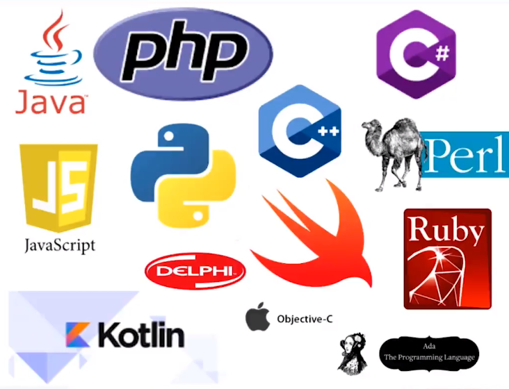

Lo mas importante mas alla del lenguaje que se escoja es aprender a programar.

Es recomendable no solo especializarse en un solo lenguaje, el saber programar y conocer los diferentes paradigmas de programacion ayudan a entender otros lenguajes, de esta forma en el futuro no existira algun problema de adaptabilidad y siempre es recomendable apoyarse de la documentacion de cada lenguaje, existen foros y diferentes medios donde se pueden consultar dudas que le suceden a los programadores, una de las paginas mas populares es [stackoverflow](https://es.stackoverflow.com/).

A continuacion una descripcion corta de los lenguajes de programacion orientados a objetos:

- Java:

    – Orientado a Objetos naturalmente

    – Es muy útilizado en Android

    – Es usado del lado del servidor o Server Side
    
- PHP

    – Lenguaje interpretado

    – Pensado para la Web
    
- Python

    – Diseñado para ser fácil de usar

    – Múltiples usos: Web, Server Side, Análisis de Datos, Machine Learning, etc


- Javascript

    – Lenguaje interpretado

    – Orientado a Objetos pero basado en prototipos

    – Pensado para la Web

- C#

- Ruby

- Kotlin

## Clase 5 Instalando Visual Studio Code

Pues que comience la aventura y digo aventura porque te darás cuenta de lo emocionante que será poder trabajar 4 lenguajes de programación en un solo entorno de desarrollo y sí, precisamente eso es lo que nos resuelve Visual Studio Code el cual será nuestro campeón en este curso.

Visual Studio Code lo puedes encontrar en las tres versiones básicas de Sistema Operativo (Windows, Mac y Linux) y lo puedes descargar directo en este enlace: https://code.visualstudio.com/download. Es muy ligero y basta con un Siguiente, siguiente, siguiente para instalar.


Cuando la instalación haya finalizado verás algo como esto:


¡Súper! Todo salió bien. Ahora pasemos a configurarlo para cada lenguaje.

Primero ubica la sección de **Extensiones** o en inglés **Extensions**, además de la barra de Search porque estaremos buscando la extensión para cada lenguaje.

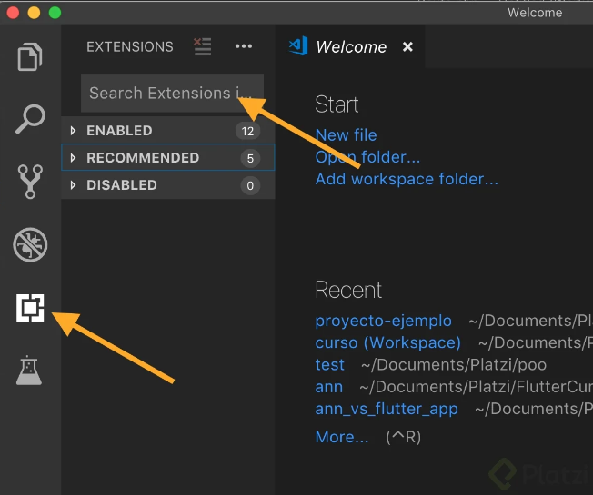

**Java**
___

En la barra de Search Extensions escribe: **Java Extension Pack** y da clic en el botón verde **Install**.

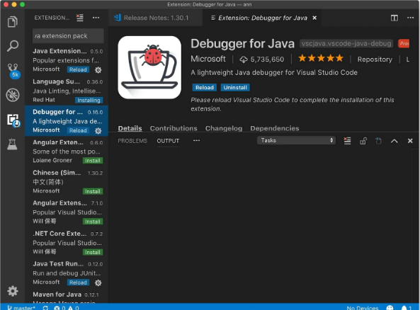

Ahora, para tener una mejor experiencia en Debugging, instala el Debugger for Java, el cual encuentras siguiendo el procedimiento anterior.

Listo, terminamos con Java. Aprende más en este enlace: https://code.visualstudio.com/docs/languages/java

Ahora vamos por Python.

**Python**
___

Comencemos instalando Python en nuestra computadora. Dirígete al sitio python.org y dale clic en el botón de Descargar.


Ve de la mano con el asistente hasta finalizar la instalación:


Terminaremos la configuración de Python en Visual Studio Code más adelante. Aprende más [aquí](https://code.visualstudio.com/docs/python/python-tutorial).

Mientras tanto sigamos con PHP.

**PHP**
___

Para configurar PHP buscaremos la extensión** PHP Server** y pulsamos Instalar


**JavaScript**
___

En este caso no necesitamos instalar absolutamente nada, utilizaremos el editor con su configuración por defecto.

**Comencemos nuestro proyecto**
___

Ya está todo listo, ahora dejemos creado el proyecto.

Para esto seleccionaremos la opción **Add workspace folder**


A continuación creamos una carpeta llamada **CursoPOOUber** y damos clic en Add para finalizar. Ahora generemos esta estructura de carpetas para manejar los documentos correspondientes al lenguaje de programación:


## Clase 6 Diagramas de Modelado

Son las herramientas necesarias para realizar el analisis necesario e implementar la forma en que se va a estructurar el programa a realizar mediante **POO**

**OMT:** Object Modeling Techniques. Creado en 1191, es una metodología para el análisis orientado a objetos. Lo que propone es que una vez ya esta hecho el analisis, identificacion de objetos, atributos, metodos y ya estan nombrados los objetos.

Dice la metodologia que se empiecen a implementar en un cuadro y con una serie de conectores se empieza a definir la relacion que tiene uno con otro:

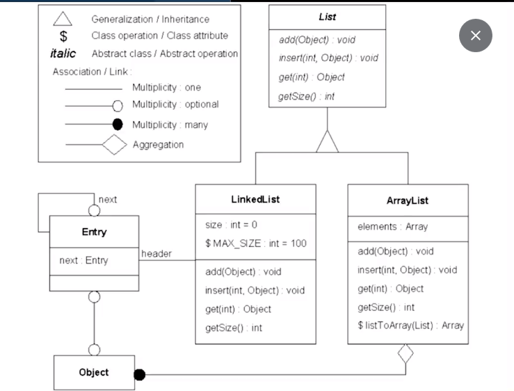

**UML:** Unified Modeling Language o Lenguaje de Modelado Unificado. Creado en 1197, Tomó las bases y técnicas de OMT unificándolas. Tenemos más opciones de diagramas como lo son Clases, Casos de Uso, Objetos, Actividades, Iteración, Estados, Implementación.

Para un proyecto donde se pide una aplicacion con programacion orientada a objetos este es el grafico que representa la forma en como se puede entregar la cual se vera mas adelante


**Nota:** Las tecnicas que se deben seguir en la actualidad son **UML**, OMT ya quedo descontinuado

## Clase 7 UML

Como ya viste UML significa Unified Modeling Language el cual es un lenguaje estándar de modelado de sistemas orientados a objetos.

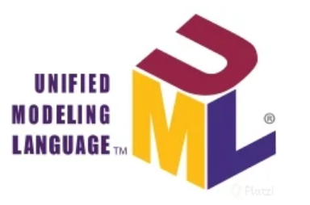

Esto significa que tendremos una manera gráfica de representar una situación, justo como hemos venido viendo. A continuación te voy a presentar los elementos que puedes utilizar para hacer estas representaciones.

Las clases se representan así:


En la parte superior se colocan los atributos o propiedades, y debajo las opera ciones de la clase. Notarás que el primer caracter con el que empiezan es un símbolo. Este denotará la visibilidad del atributo o método, esto es un término que tiene que ver con Encapsulamiento y veremos más adelante a detalle.

Estos son los niveles de **visibilidad** que puedes tener:

- private
+ public
# protected
~ default

Una forma de representar las relaciones que tendrá un elemento con otro es a través de las flechas en UML, y aquí tenemos varios tipos, estos son los más comunes:

**Asociación**
___


Como su nombre lo dice, notarás que cada vez que esté referenciada este tipo de flecha significará que ese elemento contiene al otro en su definición. La flecha apuntará hacia la dependencia.

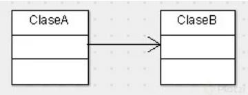

Con esto vemos que la ClaseA está asociada y depende de la ClaseB.

**Herencia**
___


Siempre que veamos este tipo de flecha se estará expresando la herencia.
La dirección de la flecha irá desde el hijo hasta el padre.


Con esto vemos que la ClaseB hereda de la ClaseA

**Agregación**
___


Este se parece a la asociación en que un elemento dependerá del otro, pero en este caso será: Un elemento dependerá de muchos otros. Aquí tomamos como referencia la multiplicidad del elemento. Lo que comúnmente conocerías en Bases de Datos como Relaciones uno a muchos.

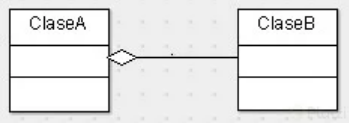

Con esto decimos que la ClaseA contiene varios elementos de la ClaseB. Estos últimos son comúnmente representados con listas o colecciones de datos.

**Composición**
___


Este es similar al anterior solo que su relación es totalmente compenetrada de tal modo que conceptualmente una de estas clases no podría vivir si no existiera la otra.

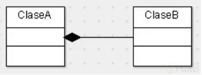

Con esto terminamos nuestro primer módulo. Vamos al siguiente para entender cómo podemos hacer un análisis y utilizar estos elementos para construir nuestro diagrama de clases de Uber.

## Clase 8 Objetos

Los Objetos son aquellos que tienen propiedades y comportamientos, también serán sustantivos.

    - Pueden ser Físicos o Conceptuales

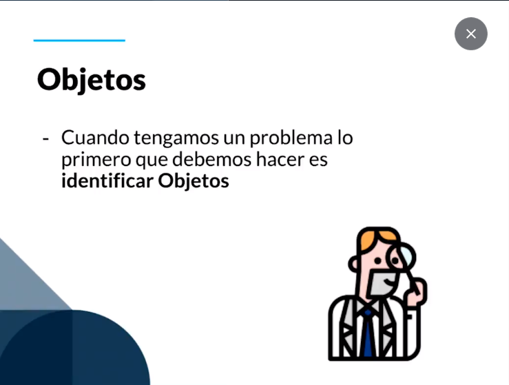


Aca un ejemplo de caso de la vida real, un objeto de tipo User o usuario es algo que se puede tocar, que interactua, etc

Un objeto conceptual puede ser una session o sesion de usuario, es algo que no se puede tocar pero si tiene comportamiento y atributos, como hacer login, logout, informar si el usuario esta creado o no, informar si la contraseña esta mal, etc

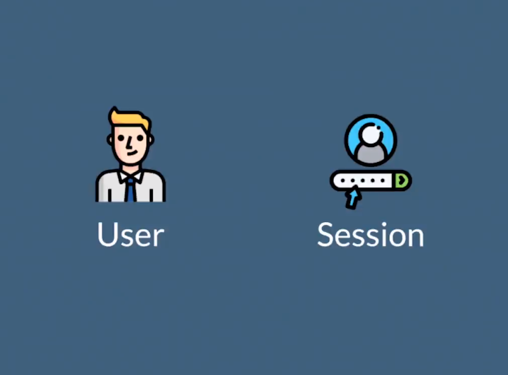

Las **Propiedades** también pueden llamarse atributos y estos también serán sustantivos. Algunos atributos o propiedades son nombre, tamaño, forma, estado, etc. Son todas las características del objeto.

Para explicar mejor esto no quiere decir que el nombre Jeyfred Calderon sea propiamente el atributo, lo que realmente es el atributo de una clase es **nombre** o que el atributo sea grande, el atributo realmente es **tamaño**

Los **Comportamientos** serán todas las operaciones que el objeto puede hacer, suelen ser verbos o sustantivos y verbo. Algunos ejemplos pueden ser que el usuario pueda hacer `login()` y `logout()`.

**Aqui un ejeḿplo:**

El objeto perro tiene propiedades que a continuacion se listan, pueden ser mas de las que representa la imagen


Ademas de tener estas propiedades o atributos tambien puede tener comportamientos


**otro ejemplo**

Aqui existe un sistema de adopciones, donde la persona ve un catalogo de perros y quiere escoger cual de ellos se quiere llevar 

El catalogo debe tener un identificador, el cual diferencia a uno de los perros de los demas porque pueden tener la misma raza, color, altura, etc, pero realmente el identificador es el que lo va a diferenciar del resto 

En este contexto lo que realmente importa es que el perro sea adoptado por tal razon el comportamiento que se tendra es **ser adoptado** sin tener en cuenta los comportamientos del ejemplo anterior


## Clase 9 Abstracción y Clases

Una **Clase** es el modelo por el cual nuestros objetos se van a construir y nos van a permitir generar más objetos.

Analizamos Objetos para crear **Clases**. Las **Clases** son los modelos sobres los cuales construiremos nuestros objetos.

**Abstracción** es cuando separamos los datos de un objeto para generar un molde.

En el ejemplo anterior se hablaba de un perro que tenia unas propiedades y unos comportamientos.

Pero existen perros de diferentes razas, nombres, colores, etc.

Para esto es la clase para definir de una forma general 

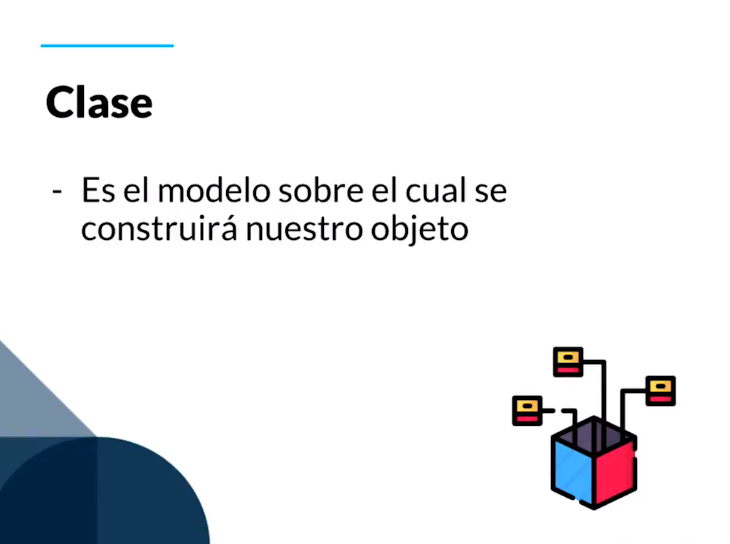

En este caso al perro, todos los perros cuentan con caracteristicas en comun como por ejemplo tener un nombre, raza, color, etc.

Los objetos son elementos de nuestra realidad con los que interactuamos(pueden ser físicos o conceptuales).

Los patrones o aspectos comunes que hallamos al observar objetos similares nos forman un concepto de lo que ese objeto representa para nosotros, como lo percibimos o representamos. La obtención las ideas principales o esencia común de los objetos analizados se llama abstracción; El concepto idealizado, generalizado de dichos objetos viene a ser representado por la “Clase”.

La clase es un modelo del objeto, algo así como un sello o molde y los objetos serían como la estampa o elemento elaborado por el molde; Los objetos son ejemplares de una clase. Entendemos a estas “clases” como dos conjuntos de: atributos o propiedades y comportamientos. (Las clases son sustantivos)

Los atributos (también son sustantivos, generalmente descriptivos) son características o propiedades, rasgos, adjetivos que definen al modelo. Por ejemplo, los atributos de una clase serian: id, nombre, raza, color; y los de un objeto serían: 101, Rocky, Dálmata, Blanco moteado negro.

Los comportamientos también definen la clase o al objeto mediante acciones que puede realizar (por tanto, son verbos o sustantivo_verbo)

El contexto es clave para realizar una abstracción útil que realmente ayude a resolver el problema planteado.

## Clase 10 Modularidad

La **modularidad** va muy relacionada con las clases y es un principio de la Programación Orientado a Objetos y va de la mano con el Diseño Modular que significa dividir un sistema en partes pequeñas y estas serán nuestros módulos pudiendo funcionar de manera independiente.

Un ejemplo de modularidad es construir elementos a traves de modulos en distintas partes, generando cada elemento y luego unificandolo para construir un conjunto de elementos, si en dado caso se quisiera cambiar alguna parte de algun modulo se puede hacer y no tiene porque afectar al resto de los otros modulos

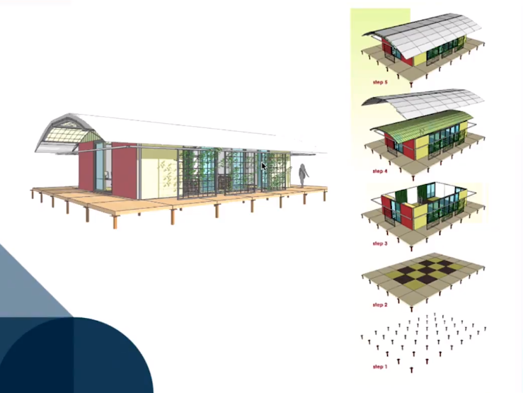


La **modularidad** de nuestro código nos va a permitir

- Reutilizar

- Evitar colapsos

- Hacer nuestro código más mantenible

- Legibilidad

- Resolución rápida de problemas

Una buena práctica es separando las clases en archivos diferentes para generar modularidad.

## Clase 11 Analizando Uber en Objetos

Para resolver un problema es importante dividirlos en pequeños modulos y de aqui parte el problema a analizar de Uber  

1. Todo parte de una necesidad, es necesario contar con un celular y querer trasladarse de un punto A a un B

2. Se solicita un automovil y en la app se seleccion de que punto a que punto se va a trasladar 

3. La app muestra un catalogo de servicios el cual cada uno de ellos tiene un costo por ser servicios diferentes

    - Uber x

    - Uber Pool

    - Uber Black

    - Uber Van

4. Cuando se elige uno de los servicios, el usuario espera que lo recoja el automovil que decidio escoger para prestar el servicio y trasladar del punto A escogido por el usuario al punto B


Ahora lo que hay que realizar es empezar a abstraer los objetos 

**Objetos**

1. User -> Quien solicita al automovil

2. Route -> Necesidad de trasladar de un punto A a un punto B

3. 4 objetos que aparecen. Uber x, Uber Pool, Uber Black, Uber Van

4. Driver -> El cual representa al conductor

5. Card, Paypal, cash -> Las cuales representan la forma en que se va a pagar el servicio al estar completo y finalizado

6. Trip -> Es de tipo conceptual y va a captar quien esta ejecutando el viaje, el lugar de recogida y entrega, ruta del mapa, etc

## Clase 12 Reto 1: identificando objetos

Ya estás listo para resolver tu primer reto y poner en práctica todo lo que aprendiste para identificar objetos en un problema.

Toma como referencia nuestro Sistema de Adopciones e identifica todos los objetos.


1. Existe la necesidad de adoptar un perro, para ello una persona se debe trasladar a las instalaciones fisicas por ejemplo de una fundacion de perros que permite la adopcion de perros

2. Debe existir una persona disponible la cual atienda y muestre de manera fisica los perros que estan disponibles para adopcion

3. Los perros estan disponibles para que la persona los vea y escoja cada uno de ellos 

**Objetos**

1. User -> Quien tiene la necesidad de adoptar al perro.

2. Employee -> Persona encargada de hacer el tramite para hacer la adopcion del perro

3. Dog -> El perro que se va a escoger para adoptar 

## Clase 13 Clases en UML y su sintaxis en código

Una clase esta representada por un rectangulo como el que se presenta a continuacion y este esta compuesto por Identidad que es el nombre de la clase, el estado que son los atributos y el comportamiento que seran las funcionalidades de la clase


Aqui un ejemplo de clase. Se presenta la clase o objeto persona que como atributo tiene un nombre y el comportamiento o funcion es caminar

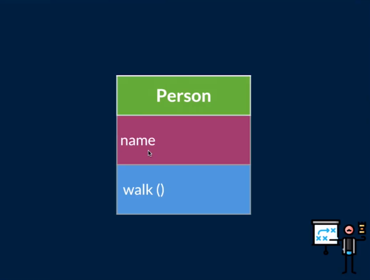

Estas son las formas de crear clases en los diferentes lenguajes de programacion.

En la actualidad JavaScript tambien define sus clases con la palabra reservada **class**


creando en cada uno de los lenguajes es la forma como se construye una clase con su atributo y metodo 

**Nota:** la Sintaxis de JavaScript queda a continuacion de la imagen


```
class Person {
  constructor() {
    this.name = '';
  }
  walk() {...}
}
```

## Clase 14 Modelando nuestros objetos Uber

Los objetos analizados en la clase 12 donde se identificaron los objetos se establecio que eran los siguientes, cada uno de estos va estar compuesto por lo que esta a continuacion de la flecha -> y el ejemplo representa a la Ciudad de Mexico porque los vehiculos Uber black y Uber Van tienen requisitos mayores a los de la Ciudad de Bogotá

**Objetos**

User -> id, name, document, email, password
Driver -> id, name, document, email, password

**User y Driver** comparten los mismos tipos de atributos Id, nombre, documento de identificación, email y contraseña

Route -> id, start:[], end:[]

**Route** la ruta debe tener un identificador para la base de datos y debe tener una latitud por tal motivo se expresa un inicio con :[] y un fin

Uber x -> id, license, driver, passengers, brand, model
Uber Pool -> id, license, driver, passengers, brand, model

**Uber x y Uber Pool** comparten atributos parecidos porque puede ser cualquier carro y modelo

Uber Black -> id, license, driver, passengers, typeCarAccepted[], seatsMaterial[]
Uber Van -> id, license, driver, passengers, typeCarAccepted[], seatsMaterial[]

**Uber black y Uber Van** en las caracteristicas del servicio, aceptan un tipo de carro especial que esta clasificado en la [pagina](https://www.uber.com/mx/es/drive/mexico-city/vehicle-requirements/) y adicionalmente el requisito del material de los asientos es de piel y no puede ser cualquiera


Card -> id, number, cvv, date

**Card** el objeto debe tener identificador, numero de tarjeta, el numero oculto de la tarjeta para autorizar transacciones y la fecha

Paypal -> id, email

**Paypal** solo requiere un identificador e email

Cash  -> id

**Cash** solo requiere el identificador porque no se tiene informacion de nada mas, para esto se tendra que establecer otro objeto

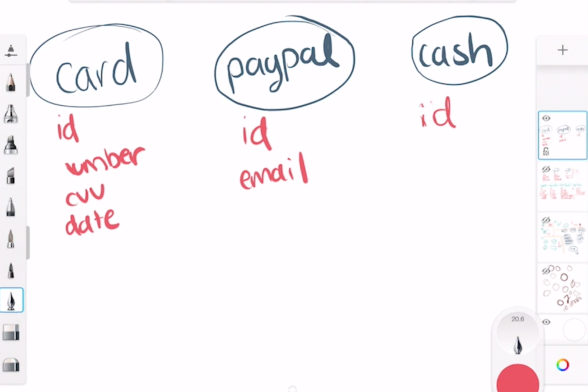

## Clase 15 ¿Qué es la herencia?

Al analizar el ejercicio de la clase anterior, se puede observar que hay propiedades que comparten propiedades o atributos. 

Cuando existen estas redudancias es necesario implementar la herencia en las clases.

**Don’t repeat yourself** es una filosofía que promueve la reducción de duplicación en programación, esto nos va a inculcar que no tengamos líneas de código duplicadas.

Toda pieza de información nunca debería ser duplicada debido a que incrementa la dificultad en los cambios y evolución

Es decir que no se debe repetir codigo porque esto hace que sea mucho mas complejo de entender y manejar, siempre se debe optar por reducir al minimo los bloques de codigo, en caso que una clase comparta similitudes con otra clase se puede utilizar la herencia.

La **herencia** nos permite crear nuevas clases a partir de otras, se basa en modelos y conceptos de la vida real. También tenemos una jerarquía de **padre e hijo.**


Decir **padre e hijo** en programación se traduce a decir **Súperclase y Subclase**

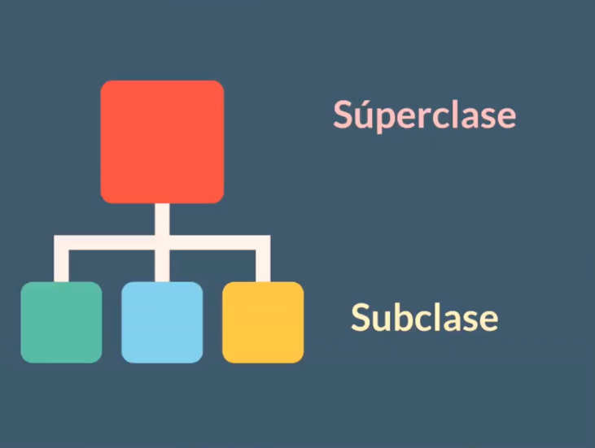

En la siguiente imagen se puede observar que Futbolista, Entrenador y Masajista comparten los mismos atributos al igual que metodos los cuales son Concentrarse y Viajar, al dejar de esta forma cada una de las clases siginifica que mas adelante puede presentarse alguna forma y la idea es implementar la filosofia **Don’t repeat yourself**

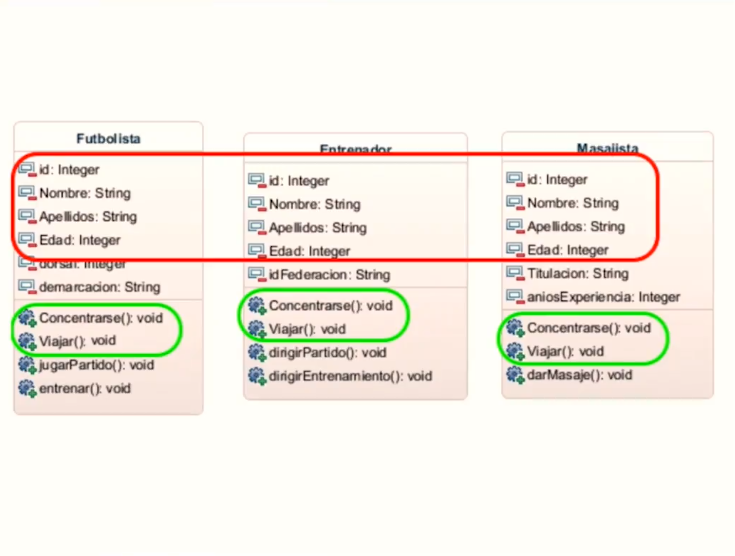

Para solucionar este problema se crea una **Súperclase** la cual en la imagen a continuacion se llama **SeleccionFutbol**, que tiene los atributos y metodos que comparten cada una de las **Subclases**.

Las **Subclases** en este caso deben heredar de la **Súperclase** y haciendo esto ademas de heredar, cada una puede implementar sus propios metodos

Tambien es importante tener en cuenta que no es obligatorio que la **Subclase** herede todos los metodos de la **Súperclase**, es decir por ejemplo la clase Masajista puede heredar el metodo concentrarse y las Clases Futbolista y Entrenador pueden heredar de los metodos Concentrarse y Viajar


## Clase 16 Aplicando Herencia a nuestro proyecto Uber

A traves del diagrama se va a detectar todos los atributos del proyecto Uber que estan repetidos o son redudantes


Todos los atributos de **User y Driver** son iguales por tanto se puede sacar una **Súperclase** padre llamada **Account**

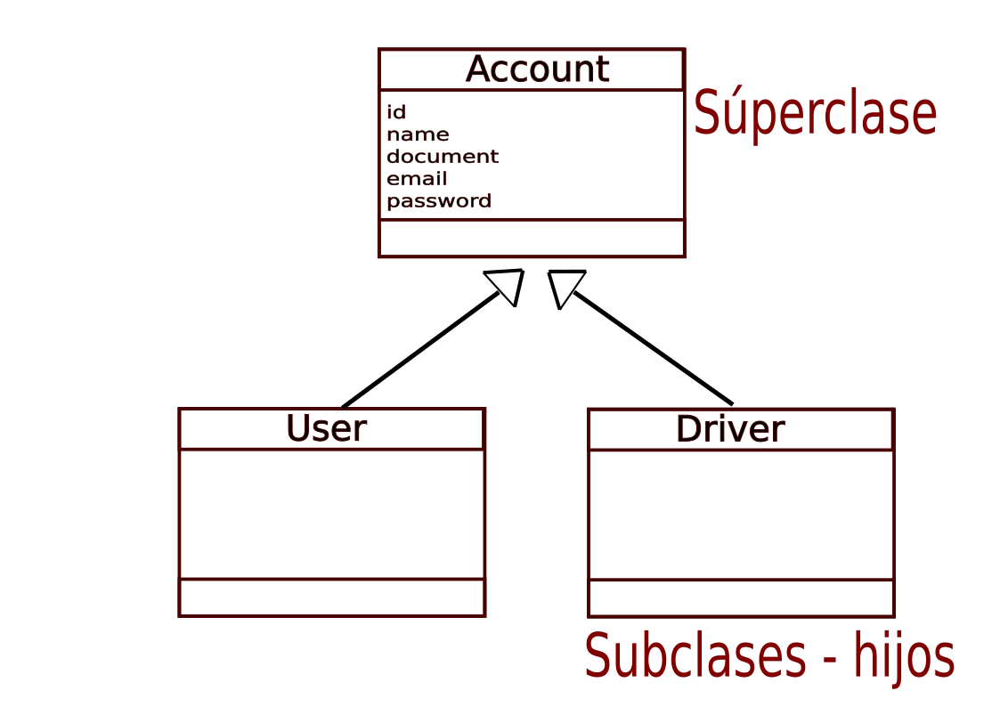

Tambien se puede realizar la parte de pagos

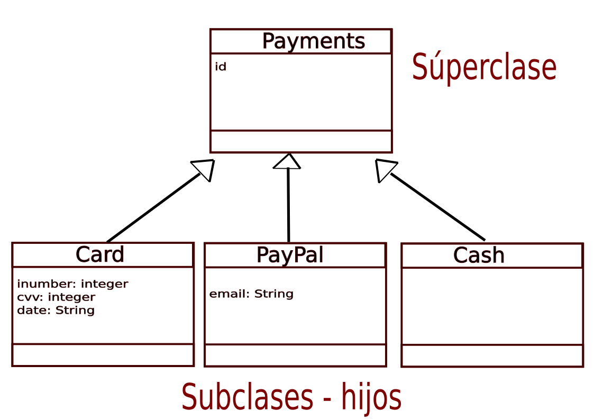

y por ultimo la parte de los vehiculos Uber

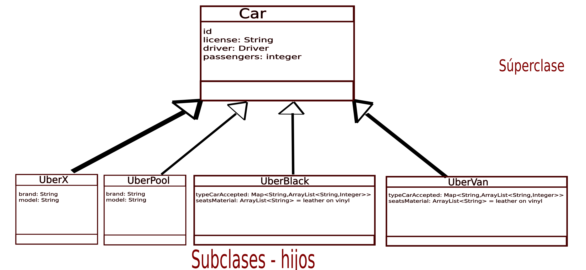

Por ultimo este es el modelo simplificado del sitema Uber

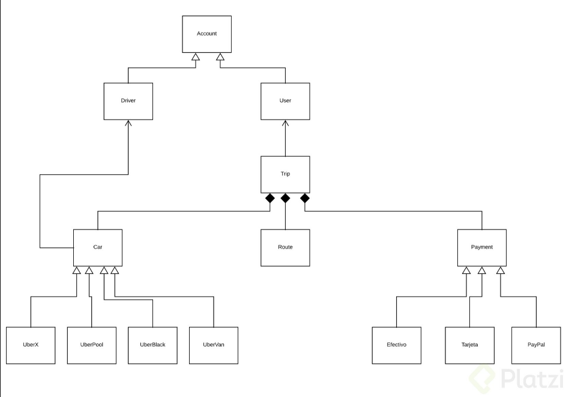